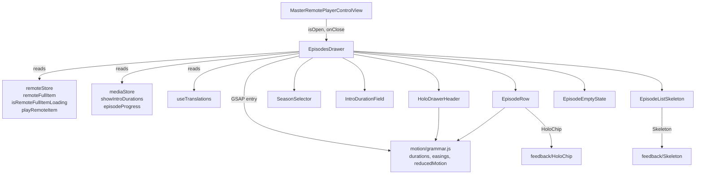

# Requirements

### Overview & Goals

Bring `frontend/components/remote/master/EpisodesDrawer.jsx` up to the project's current visual + interaction standards (the "cinematic / holographic" design system defined in `frontend/styles/cinematic.css` and used by `ModalShell`, `HoloCard`, `HoloPlayerControls`, `HoloChip`, `FloatingDock`, `Skeleton`, and the master detail view). The current drawer ships with raw MUI styling, no entry animation, plain text rows, and no reduced-motion handling. The target state matches the rest of the app: holographic surface with neon edge and specular sweep, GSAP entry timeline with reduced-motion fallback, rich episode rows (thumbnail, language chips, progress bar, watched badge, runtime, playing indicator), an animated `Skeleton` loading state, an empty state, and proper accessibility.

### Scope

**In scope**
- `frontend/components/remote/master/EpisodesDrawer.jsx` (rewrite, keep the public prop contract: `isOpen`, `onClose`, `onSelectEpisode`).
- Apply the project's design tokens (`--bg-deep`, `--holo-grad`, `--neon-accent`, `--neon-accent-hot`, `--text-primary`, `--text-secondary`, `--edge-glow`, `--motion-med`, `--motion-easing-standard`, etc.) and motion tokens from `frontend/motion/grammar.js`.
- Align the row design with the rich precedent in `frontend/components/library/EpisodesDrawer.jsx` (thumbnail via `episode.still_path`, language chips from `episode.video_urls`, progress, watched badge, runtime), but stay compatible with the simpler remote data shape (`episode.video_url` for playability).
- Add a GSAP entry timeline for the paper and a stagger reveal for the episode rows, with the `reducedMotion()` collapse to `durations.fadeFallback`.
- Replace the `...` loading placeholder with the `Skeleton` component and add an empty state.

**Out of scope**
- Refactoring the parallel `frontend/components/library/EpisodesDrawer.jsx` (separate code path, separate owner).
- Adding a new MobX store (AGENTS.md says state belongs in stores; the drawer only consumes existing observables, no new state is created).
- Touching the parent `MasterRemotePlayerControlView.jsx` (prop contract stays the same; the existing `e2e-tests/tests/remote-episodes-drawer.spec.js` selectors keep resolving).
- New translations (only `t('remote.player.episodes')` and `t('remote.player.introDuration')` are used; both already exist in `frontend/locales/en.js` and `frontend/locales/it.js`).

### User Stories

- As a remote-control user, I want the episodes drawer to look and animate like the rest of the futuristic UI so that I can navigate without context switching.
- As a user choosing what to play next, I want to see thumbnail, runtime, language availability, watched state, and a progress bar so I can pick up where I left off.
- As a keyboard or screen reader user, I want the drawer and its controls to have proper `aria` labels, a clear `aria-current` on the playing episode, and a focus move-in on open.
- As a reduced-motion user, I want the drawer to honor my system preference and collapse entry + row reveals to a short crossfade.

### Functional Requirements

- Drawer shell: holographic surface (`holo-surface` class + `--holo-grad` overlay), neon edge with `--edge-glow`, holo sweep on hover, holo shadow, slide-in-from-right + fade-in entry timeline, safe-area insets preserved.
- Header: title "Episodes" in display font with the show name as subtitle, neon close button with `rotate(90deg)` hover, total episode count chip.
- Season selector: MUI `Select` + `MenuItem` (so existing `.MuiSelect-select` and `.MuiMenu-item` test selectors keep working), restyled with neon-edge + holo background, label "Season" in the project's translation, episode count shown for each option.
- Intro duration: MUI `TextField type="number"` (so `input[type="number"]` test selector keeps working), `sec` adornment, holographic border, default 80, with a soft hint label.
- Episode rows: thumbnail (with `TheatersIcon` fallback), episode number badge, title, language chips (from `video_urls` when present), runtime, watched badge, partial-watch progress bar, "now playing" indicator (cyan glow + bold + neon left border).
- Loading: `Skeleton` row placeholders inside the same Paper shape.
- Empty state: centered icon + copy when no episodes match the current season.
- Accessibility: `aria-label` on the Drawer, `role="region"` on the list, `aria-current="true"` on the playing episode, visible focus rings via `:focus-visible`, focus moves into the drawer on open.
- Reduced motion: GSAP timelines collapse to `durations.fadeFallback` (120 ms) per the existing convention in `ModalShell` and `CinematicDetail`.

### Non-Functional Requirements

- No new dependencies (GSAP is already used and is the only motion library in the project).
- Component remains atomic per AGENTS.md (sub-components stay inside the same file or in clearly named sub-components in the same folder; no 800-line monolith).
- No console warnings (e.g. `console.log` from the legacy "FIX:" comment blocks is left untouched in this rewrite).
- e2e tests in `e2e-tests/tests/remote-episodes-drawer.spec.js` and `e2e-tests/tests/skip-intro-duration.spec.js` must keep passing without changes.

# Technical Design

### Current Implementation

`frontend/components/remote/master/EpisodesDrawer.jsx`:
- Plain `Drawer` with `PaperProps.sx: { bgcolor: 'background.paper' }`, no animation, default 350 px width.
- Header: a `Box` with `Typography variant="h6"` and an `IconButton` with `<CloseIcon/>`.
- Intro duration: a vanilla `TextField type="number"` with `sec` adornment.
- Season selector: a vanilla `FormControl` + `InputLabel` + `Select` + `MenuItem`.
- Episode list: a plain `List` + `ListItem` + `ListItemButton` rendering `${episode.episode_number}. ${episode.name}` with `noWrap`, disabled when `!episode.video_url`, selected when `episode.id === nowPlayingItem.id`.
- Loading state: literal `...` centered in a `Box`.
- No empty state, no accessibility wiring beyond the default `aria-label`s, no reduced-motion handling, no entry animation.

The wider design system (used as the reference for "current standards"):
- `frontend/styles/cinematic.css` — design tokens (`--bg-deep`, `--holo-grad`, `--neon-accent`, `--edge-glow`, `--motion-med`, `--motion-easing-standard`), helper classes (`.holo-surface`, `.neon-edge`, `.scanline`, `.shimmer`).
- `frontend/motion/grammar.js` — `durations`, `easings`, `stagger`, `reducedMotion()` helper.
- `frontend/components/modals/ModalShell.jsx` — canonical pattern for a holo surface + GSAP entry timeline + reduced-motion fallback.
- `frontend/components/media/HoloPlayerControls.jsx` — canonical pattern for a holo wrapper with sweep + `ScanlineOverlay`.
- `frontend/components/library/EpisodesDrawer.jsx` — rich row design (thumbnail, language chips, progress, watched badge) used as the feature reference.
- `frontend/components/feedback/Skeleton.jsx` + `ScanlineOverlay.jsx` + `HoloChip.jsx` — the primitives we will reuse.

### Key Decisions

1. **Drawer stays a `Drawer` (not a `Dialog`/modal shell).** The current architecture is a right-anchored side panel; switching to a dialog would change the UX and break the prop contract. We keep `Drawer` and apply the same `holo-surface` + neon-edge + holo-sweep visual vocabulary to its `Paper`, mirroring how `HoloPlayerControls` wraps a `VideoControlsContainer` with a holo container.
2. **GSAP for entry, CSS hover for state.** Entry animation uses a GSAP timeline (with `reducedMotion()` guard) like `ModalShell`; hover/sweep and per-row hover use CSS transitions (cheaper, no GSAP overhead while the drawer is open). Stagger is applied only on the initial open, not on selection.
3. **Rich rows, simple data model.** We render thumbnail + chips + progress + watched + runtime, but we keep the existing `episode.video_url` singular playability check (the remote flow is read-mostly — the slave, not the master, plays the video). When `episode.video_urls` (plural) is present we surface language chips as in the library version; otherwise we hide the chip row.
4. **Test compatibility is a hard requirement.** Selectors that must keep resolving: `#episodes-drawer` (id on the Drawer), `.MuiSelect-select` (MUI's select element), `.MuiMenu-item` (MUI's menu items), `li[role="option"]` (ListItemButton default role), `input[type="number"]` (intro duration field). We therefore keep MUI's `Select`/`MenuItem`/`ListItemButton`/`TextField type="number"` and add `data-testid="episode-row-${id}"` for extra robustness.
5. **Atomic split inside the same file.** AGENTS.md requires atomic components. We split the render into `HoloDrawerHeader`, `SeasonSelector`, `IntroDurationField`, `EpisodeRow`, `EpisodeListSkeleton`, `EpisodeEmptyState` as sub-components inside the same file, mirroring how `ModalShell` and `EpisodesDrawer (library)` are organized.

### Proposed Changes

- Rewrite `frontend/components/remote/master/EpisodesDrawer.jsx`:
  - `Drawer` `PaperProps.sx` becomes a holo surface: `background: 'var(--bg-deep)'`, `backgroundImage: 'var(--holo-grad)'`, `borderLeft: '1px solid rgba(76, 210, 255, 0.35)'`, `boxShadow: '0 0 24px rgba(76, 210, 255, 0.3), 0 18px 40px rgba(0,0,0,0.55)'`, `backdropFilter: 'blur(12px) saturate(140%)'`, plus the `holo-surface` class for the hover sweep.
  - Add a `paperRef` and a `useEffect` that runs a GSAP timeline on `isOpen` going from false to true: `fromTo(paper, { autoAlpha: 0, x: 24, filter: 'blur(6px)' }, { autoAlpha: 1, x: 0, filter: 'blur(0px)', duration: durations.med, ease: easings.emphasized })`. Reduced-motion branch: `fromTo(paper, { autoAlpha: 0 }, { autoAlpha: 1, duration: durations.fadeFallback })`. Kill on unmount.
  - `HoloDrawerHeader`: title in `'Space Grotesk'` weight 700, show name as subtitle in `'Inter'`, close button with `color: var(--neon-accent)` and `&:hover { transform: 'rotate(90deg)', color: var(--neon-accent-hot) }` matching `ModalShell`. Add a `<HoloChip>` showing total episode count.
  - `SeasonSelector`: keep MUI `FormControl`/`InputLabel`/`Select`/`MenuItem`; restyle with `sx={{ '& .MuiOutlinedInput-notchedOutline': { borderColor: 'rgba(76,210,255,0.35)' }, '&:hover .MuiOutlinedInput-notchedOutline': { borderColor: 'var(--neon-accent-hot)' }, '&.Mui-focused .MuiOutlinedInput-notchedOutline': { borderColor: 'var(--neon-accent)', boxShadow: 'var(--edge-glow)' } }}`. Append ` · {n} ep` to each `MenuItem` label.
  - `IntroDurationField`: restyle the same way, add a `FormHelperText` with "Default 80 sec" so the field is self-documenting. Preserve `InputAdornment position="end">sec</InputAdornment>`.
  - `EpisodeRow`:
    - 120x68 thumbnail with `CardMedia` + `TheatersIcon` fallback (matches library version) and a `LinearProgress` strip at the bottom for partial watch (using `episodeProgress.get(episode.id)` from `mediaStore`).
    - A cyan "now playing" indicator: a 2 px `borderLeft: '2px solid var(--neon-accent)'` + a small `PlayArrowIcon` chip + `fontWeight: 700`.
    - Watched badge: a `CheckCircleIcon` overlay when `episodeProgress?.watched` is true.
    - Language chips: read `episode.video_urls`, dedupe `{lang, type}`, render `<HoloChip>` per chip.
    - Runtime: append ` · {runtime} min` to the title row when present.
    - Wrap with `transition: 'background 180ms cubic-bezier(0.22,1,0.36,1), transform 180ms cubic-bezier(0.22,1,0.36,1), border-color 180ms'`, hover `background: 'rgba(76,210,255,0.06)'`, `borderColor: 'var(--neon-accent)'`, focus-visible neon ring (using the global `:focus-visible` rule from `cinematic.css`).
  - `EpisodeListSkeleton`: 6 `<Skeleton />` rows using the project's `Skeleton` component with `borderRadius={10}` and 320 ms stagger, only rendered on the first mount to avoid re-shimmering on selection.
  - `EpisodeEmptyState`: `TheatersIcon` + "No episodes available for this season" copy, in the project's text colors.
  - Accessibility: `<Drawer aria-label="Episodes">`, `<List role="region" aria-label="Episode list">`, `<ListItemButton aria-current={isCurrent ? 'true' : undefined}>`, focus moves to the close button on open (via `autoFocus` prop on the close `IconButton`), close on `Escape` (MUI default).
  - Row reveal: a second GSAP timeline, scoped via `gsap.matchMedia(reducedMotionCondition())` per `motion/registry.js`, that staggers the rows in by 30 ms when the drawer first opens; reduced-motion branch skips it.
  - Sub-components live in the same file as `EpisodesDrawer` to keep the import surface stable.

### Data Models / Contracts

- `episode` shape used by the drawer (read-only):
  - `id: number|string`, `episode_number: number`, `name: string`, `still_path?: string`, `video_url?: string`, `video_urls?: Array<{ url: string, language: string, type: 'dub'|'sub' }>`, `runtime?: number`.
- `remoteStore` (read-only): `remoteFullItem`, `isRemoteFullItemLoading`, `playRemoteItem`, `remoteSlaveState.nowPlayingItem`.
- `mediaStore` (read-only): `showIntroDurations`, `setShowIntroDuration`, `episodeProgress`.
- Public component contract (unchanged): `({ isOpen, onClose, onSelectEpisode }) => JSX`. The `onSelectEpisode` prop is preserved for backwards compatibility but the internal `handleSelectEpisode` continues to call `playRemoteItem` directly (same behavior as today).

### Components

- `EpisodesDrawer` (main, `observer`) — open/close lifecycle, GSAP entry, focus management.
- `HoloDrawerHeader` (sub) — title, subtitle, close button, total chip.
- `SeasonSelector` (sub) — `Select`/`MenuItem` with holographic styling.
- `IntroDurationField` (sub) — number field with helper text.
- `EpisodeRow` (sub) — thumbnail, number, title, chips, progress, watched, runtime, playing indicator.
- `EpisodeListSkeleton` (sub) — `Skeleton` rows for the loading state.
- `EpisodeEmptyState` (sub) — icon + copy.

### File Structure

- `frontend/components/remote/master/EpisodesDrawer.jsx` — full rewrite, all sub-components live in this file (same pattern as `ModalShell.jsx`).
- No new files. No store changes. No test changes (the existing e2e specs keep passing as-is).

### Architecture Diagram

### Risks

- **e2e selector regression**: `#episodes-drawer`, `.MuiSelect-select`, `.MuiMenu-item`, `li[role="option"]`, `input[type="number"]` are the contract. Mitigation: keep MUI primitives + the existing id; add `data-testid="episode-row-${id}"` as a bonus selector.
- **GSAP memory leaks**: stale timelines if `isOpen` toggles rapidly. Mitigation: mirror `ModalShell` (track `lastOpenRef` and `tl.kill()` in the cleanup callback).
- **Reduced-motion regression**: the entry timeline must collapse. Mitigation: branch on `reducedMotion()` at the top of the effect, exactly like `ModalShell.jsx`.
- **Episode data shape variance**: `video_url` is singular in this flow, `video_urls` (plural) only sometimes exists. Mitigation: derive chips from `video_urls || []` and playability from `!!video_url || (video_urls && video_urls.length > 0)`.
- **Long episode names overflow the row**: the current `noWrap` would clip. Mitigation: allow two-line wrap with `lineHeight: 1.3` and `overflow: hidden; textOverflow: ellipsis; display: -webkit-box; -webkit-line-clamp: 2; -webkit-box-orient: vertical`, matching the library version.

# Testing

### Validation Approach

The agent should verify the upgrade against the existing e2e specs and by running the live drawer through Playwright. The existing e2e specs are the safety net; the live browser pass is what proves the visual + motion polish actually shipped.

### Key Scenarios

- `e2e-tests/tests/remote-episodes-drawer.spec.js` — opens the drawer, finds `#episodes-drawer .MuiSelect-select`, switches seasons via `.MuiMenu-item`, clicks an episode row, re-opens the drawer, asserts the season selection persisted. **All steps must pass without code changes.**
- `e2e-tests/tests/skip-intro-duration.spec.js` — opens the drawer, edits `input[type="number"]`, presses Escape, verifies the slave skip duration. **All steps must pass without code changes.**
- `e2e-tests/tests/master-remote-progress-time-layout.spec.js` and `master-remote-slider-drag-preview.spec.js` — must keep passing (they touch the same parent view).
- Live Playwright walkthrough: open `http://localhost:3002/`, start playback of a series, tap "Episodes" in the master remote, screenshot the drawer (closed, opening, fully open, with an episode selected, with intro duration edited, on a season with no episodes), confirm no console errors, confirm the close button focus is moved into the drawer.

### Edge Cases

- Drawer opens while `isRemoteFullItemLoading` is true: shows the `Skeleton` rows.
- Drawer opens before `remoteFullItem` is loaded: shows the same `Skeleton` (no header content) until the data lands.
- A season with zero episodes: shows the `EmptyState`.
- An episode with no `video_url` and no `video_urls`: row is disabled and dimmed (matches the current `disabled={!episode.video_url}` behavior, with `video_urls.length` as a fallback).
- An episode partially watched: shows the `LinearProgress` strip.
- A fully watched episode: shows the `CheckCircleIcon` overlay.
- Rapid open/close toggling: GSAP timeline is killed in the cleanup callback, so no leaks.
- `prefers-reduced-motion: reduce` (set via DevTools): entry + stagger collapse to a 120 ms fade; no blur, no slide.
- RTL languages (Italian / English are LTR today, but the design must not break if the locale flips): flex direction is row-default, no `direction: rtl` overrides.

### Test Changes

- None. The e2e specs already exercise the right selectors; the rewrite keeps all of them working.
- The agent should manually run the live drawer via Playwright (mcp__playwright__browser_navigate, browser_snapshot, browser_take_screenshot) to confirm the visual polish and reduced-motion branch.

# Delivery Steps

### ✓ Step 1: Refactor the drawer shell + header with holographic surface and GSAP entry animation
Apply the cinematic design tokens to the Drawer paper, the header, and the close button; add the GSAP entry timeline with the reduced-motion fallback.

- In `frontend/components/remote/master/EpisodesDrawer.jsx`, replace the `Drawer` `PaperProps.sx` with the holo surface recipe: `background: 'var(--bg-deep)'`, `backgroundImage: 'var(--holo-grad)'`, `borderLeft: '1px solid rgba(76, 210, 255, 0.35)'`, `boxShadow: '0 0 24px rgba(76, 210, 255, 0.3), 0 18px 40px rgba(0,0,0,0.55)'`, `backdropFilter: 'blur(12px) saturate(140%)'`, plus the `holo-surface` class for the moving sweep.
- Add a `paperRef` and a `useEffect` that runs the GSAP entry timeline on `isOpen` going from false to true (slide from right + fade + blur-clear, `durations.med` + `easings.emphasized`), exactly mirroring the `ModalShell` pattern; collapse to `durations.fadeFallback` when `reducedMotion()` is true; kill the timeline in the cleanup callback.
- Extract a `HoloDrawerHeader` sub-component: title in `'Space Grotesk'` weight 700, show name as subtitle (`mediaStore` title), close `IconButton` with `color: var(--neon-accent)` and `&:hover { transform: 'rotate(90deg)', color: var(--neon-accent-hot) }` matching `ModalShell`; a `<HoloChip>` showing total episode count.
- Keep the `id="episodes-drawer"` on the `Drawer` and the existing prop contract (`isOpen`, `onClose`, `onSelectEpisode`) so the e2e specs and `MasterRemotePlayerControlView` keep working.
- Add `aria-label="Episodes"` on the Drawer and a small focus management (autoFocus on the close button) so screen reader and keyboard users land inside the drawer on open.

### ✓ Step 2: Refactor the season selector and intro duration controls with the holographic form style
Bring the two form controls up to the futuristic visual standard while preserving the MUI primitives the e2e tests rely on.

- Replace the raw `TextField` for intro duration with a holographic restyle (still MUI `TextField` with `type="number"` and the `sec` `InputAdornment` so `input[type="number"]` keeps resolving): restyled `notchedOutline` with `borderColor: 'rgba(76,210,255,0.35)'`, hover `var(--neon-accent-hot)`, focused `var(--neon-accent)` + `boxShadow: var(--edge-glow)`; add a `FormHelperText` "Default 80 sec" using `var(--text-secondary)`; extract as `IntroDurationField` sub-component.
- Replace the raw `FormControl` + `InputLabel` + `Select` + `MenuItem` for the season picker (keeping MUI primitives so `.MuiSelect-select` and `.MuiMenu-item` keep resolving): apply the same notched-outline treatment, neon label color, and a per-option suffix ` · {n} ep` showing how many episodes are in that season; extract as `SeasonSelector` sub-component.
- Wire the helper text to the same `t('remote.player.introDuration')` translation and keep the existing `onFocus={(event) => event.target.select()}` behavior so editing is fast.
- Verify visually with Playwright that focus/hover/focus-visible states all show the neon edge and the holo surface; confirm the existing e2e selectors still resolve (no DOM restructuring that would break `.MuiSelect-select` or `input[type="number"]`).

### ✓ Step 3: Refactor the episode rows with thumbnail, language chips, progress, watched badge, runtime, and playing indicator
Replace the plain one-line list rows with the rich row design used in the library version, kept compatible with the remote data shape and the e2e selectors.

- Extract `EpisodeRow` as a sub-component: 120x68 thumbnail via `CardMedia` from `episode.still_path` with a `TheatersIcon` fallback (grey 900 background, 2.5 rem icon, matching the library version), an absolute `LinearProgress` strip for partial watch (using `mediaStore.episodeProgress.get(episode.id)`), and a `CheckCircleIcon` overlay when the episode is fully watched.
- Title block: episode number on the left, name on the right with `lineHeight: 1.3`, `noWrap: false`, two-line clamp via `-webkit-line-clamp: 2`, secondary line `t('remote.detail.season', { number: seasonNumber })`, and an optional ` · {runtime} min` suffix when `episode.runtime` is set.
- Language chips: derive from `episode.video_urls` (plural, when present), dedupe by `{lang, type}`, render via the existing `<HoloChip>` primitive from `frontend/components/feedback/HoloChip.jsx`; hide the chip row when no `video_urls` is present so the simple remote data shape keeps working.
- Playing indicator: `borderLeft: '2px solid var(--neon-accent)'` + `boxShadow: inset 2px 0 0 var(--neon-accent)` + `PlayArrowIcon` chip + `fontWeight: 700` for the currently playing row; preserve the existing `selected` prop on `ListItemButton` so `li[role="option"]` keeps resolving.
- Row hover/transition: `transition: 'background 180ms cubic-bezier(0.22,1,0.36,1), transform 180ms, border-color 180ms'`, hover `background: 'rgba(76,210,255,0.06)'` + `borderColor: 'var(--neon-accent)'` + `transform: 'translateX(2px)'`; focus-visible inherits the global `:focus-visible` rule from `cinematic.css`.
- Add `data-testid="episode-row-${episode.id}"` for extra test selector robustness, and `aria-current="true"` on the currently playing row.
- Keep the existing playability check (`!episode.video_url`) but extend it to also allow `episode.video_urls?.length > 0` so future data shapes are not silently disabled.

### ✓ Step 4: Polish loading/empty states, accessibility, reduced motion, and add the row stagger reveal
Close the remaining quality gaps so the drawer matches the rest of the polished surfaces in the app.

- Replace the literal `...` loading state with `EpisodeListSkeleton`: 6 `<Skeleton />` rows from `frontend/components/feedback/Skeleton.jsx`, using the project's `borderRadius={10}` and a 30 ms CSS-only stagger; only show on the first mount so a re-open does not re-shimmer.
- Add `EpisodeEmptyState`: centered `TheatersIcon` (4 rem, `var(--text-dim)`) + body copy in `var(--text-secondary)` ("No episodes available for this season") rendered when the current season exists but has no episodes.
- Add a GSAP row stagger timeline scoped via `gsap.matchMedia(reducedMotionCondition())` from `motion/registry.js`: stagger `0.04` seconds, `autoAlpha` + `y: 12` to `autoAlpha: 1, y: 0`, `durations.med` + `easings.standard`; reduced-motion branch skips the stagger. Kill on cleanup.
- Add an `aria-label` on the `<List>` (`aria-label="Episode list"`), `role="region"` on the list wrapper, and a per-row `aria-label` that reads "Episode {n}: {name}".
- Verify the full drawer end-to-end with Playwright: closed state, opening animation, fully open, episode hovered, episode selected (current), intro duration edited, season switched, skeleton during loading, empty state, and a `prefers-reduced-motion: reduce` pass; capture screenshots and confirm no console errors.